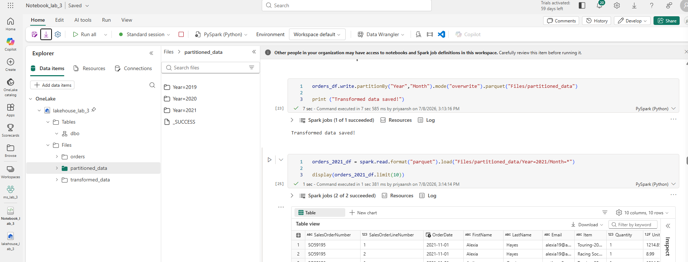
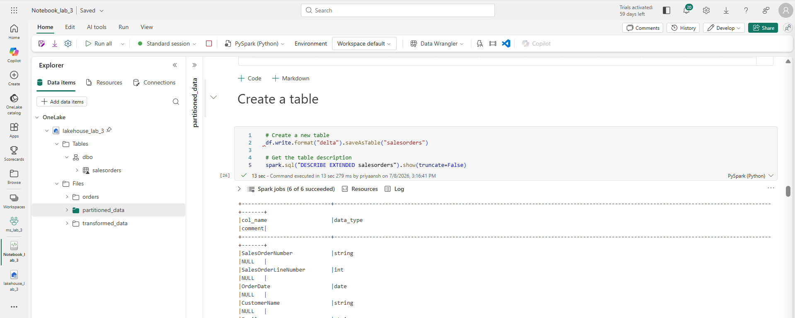
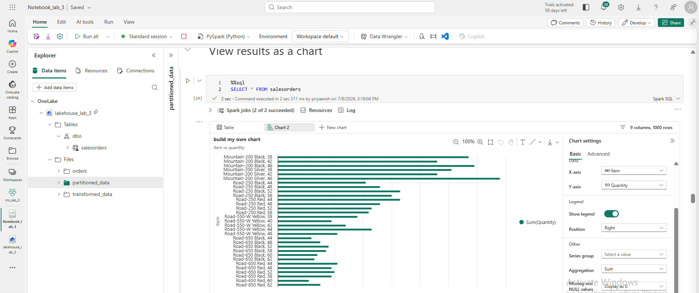

# Lab 02: Analyze Data with Apache Spark

**Source:** [MS Learn - mslearn-fabric, Lab 02](https://microsoftlearning.github.io/mslearn-fabric/Instructions/Labs/02-analyze-spark.html)

## What this lab covers

- Reading CSV data into a Spark DataFrame using both inferred and explicit schemas (`StructType`)
- Using wildcards to read multiple files from a folder (`Files/orders/*.csv`)
- DataFrame operations: column selection, filtering (`.where()`), grouping and aggregation (`.groupBy().sum()`)
- Adding derived columns (`Year`, `Month`, `FirstName`, `LastName`) using `withColumn` and `split`
- Writing data as Parquet, including **partitioned** output (`partitionBy("Year", "Month")`) and reading it back with wildcard paths
- Creating a managed Delta table (`saveAsTable`) and querying it with both DataFrame syntax and inline `%%sql`
- Visualizing results with the notebook's built-in chart view, `matplotlib`, and `seaborn`

## Notes / things I had to work through

- Confirmed that a **schema-enabled Lakehouse** is required for the `dbo.salesorders` naming convention used in the SQL queries — without it, table references would need to drop the schema prefix.
- Hit a `TooManyRequestsForCapacity` (HTTP 430) error running Spark cells on the F2 capacity — resolved by clearing stuck jobs via the Monitor hub and removing an unrelated `Monitoring_sample` folder that was consuming capacity.
- Verified the difference between the Lakehouse's **Tables** section (managed Delta tables, queryable via SQL) and its **Files** section (raw/partitioned Parquet output) — the partitioned write in this lab lands in Files, while `saveAsTable` creates a proper catalog table.

## Screenshots

**Partitioned Parquet output, read back with a wildcard path:**

**Delta table created via `saveAsTable`, with `DESCRIBE EXTENDED` output:**

**SQL query result visualized as a chart:**

